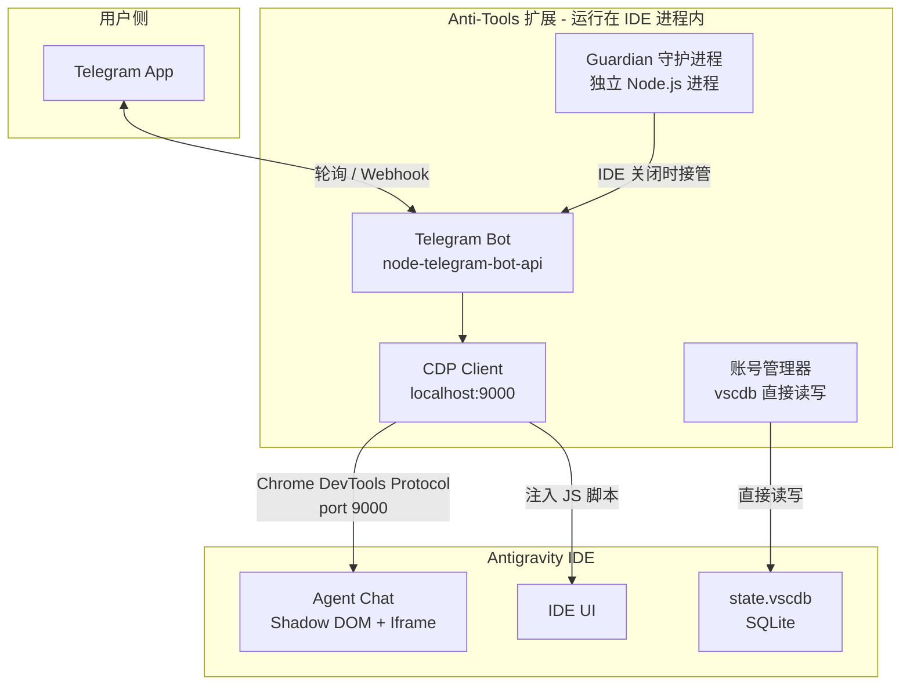
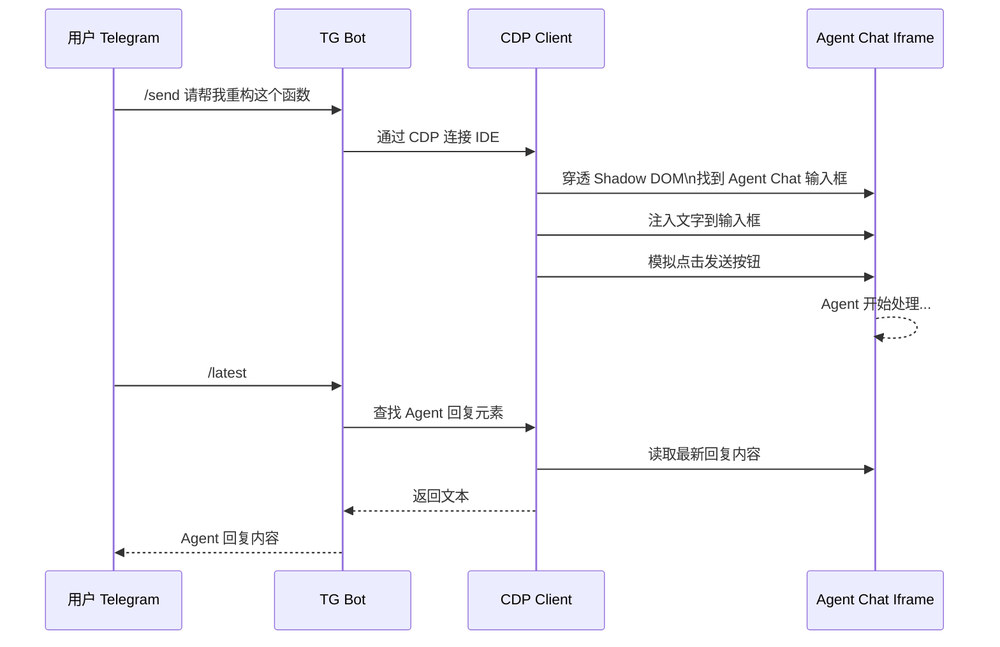
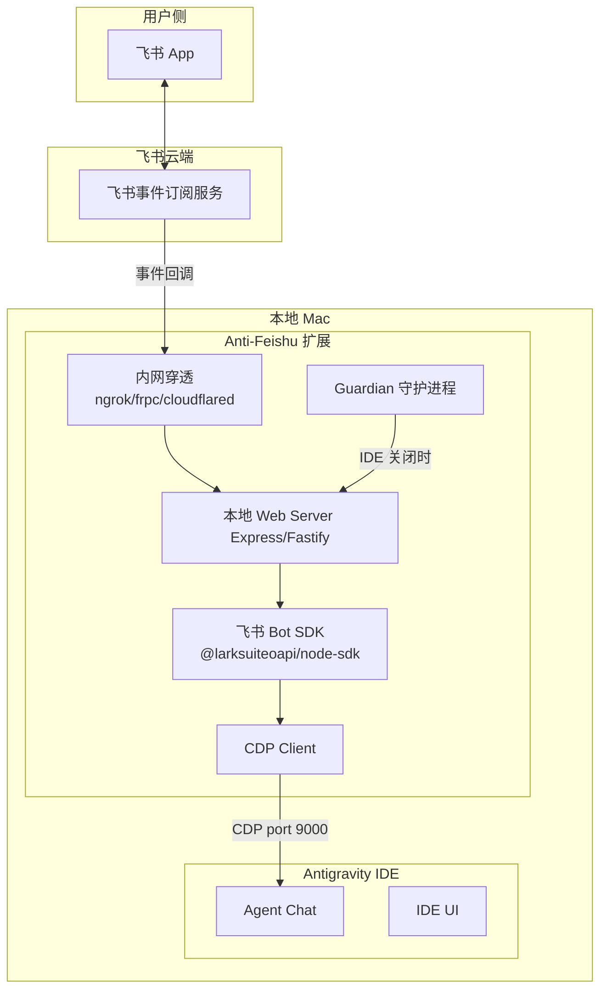

# Anti-Tools 技术分析 & Anti-Feishu 方案设计

## Anti-Tools 实现原理分析

Anti-Tools 是一个成熟的 Antigravity VS Code 扩展，通过 Telegram Bot 远程控制 IDE。其核心架构如下：

### 架构总览

### 三大核心技术

#### 1. VS Code Extension API - 扩展宿主

- **本质**: 标准的 VS Code 扩展，运行在 IDE Extension Host 进程内
- **作用**: 获得 IDE 内部能力（设置管理、文件操作、终端控制等）
- **纯 JS 实现**: 无外部依赖，所有功能自包含

#### 2. CDP（Chrome DevTools Protocol）- Agent 交互核心

这是 Anti-Tools 与 Agent 交互的**关键技术**：

| 要素 | 说明 |
|------|------|
| **启动参数** | IDE 需添加 `--remote-debugging-port=9000` |
| **连接方式** | 通过 `localhost:9000` 与 IDE 的 Chromium 内核通信 |
| **穿透能力** | 可穿透 Shadow DOM 和 Iframe（Agent Chat 窗口） |
| **操作能力** | 注入 JS、查找/点击元素、发送文字、获取截图 |

具体的 Agent 交互流程：

#### 3. Guardian 守护进程 - 全天候控制

- **独立进程**: 即使 IDE 关闭也能运行
- **开机自启**: Windows 通过启动文件夹 + VBS，macOS 可用 launchctl
- **核心能力**: `/boot` 远程启动 IDE、定时任务、配额刷新
- **崩溃恢复**: 内置看门狗逻辑

### Bot 指令体系

| 类别 | 指令 | 实现方式 |
|------|------|----------|
| **Agent 交互** | `/send` | CDP 注入文本到 Agent Chat |
| **Agent 交互** | `/stop` | CDP 点击停止按钮 |
| **Agent 交互** | `/latest` | CDP 读取最新回复 DOM |
| **模型管理** | `/models` `/select` | CDP 操作模型选择器 |
| **账号管理** | `/switch` `/quotas` | 直接读写 state.vscdb |
| **远程控制** | `/screenshot` | CDP `Page.captureScreenshot` |
| **远程控制** | `/boot` `/shutdown` | 系统进程管理 |
| **远程控制** | `/cmd` | Node.js `child_process` |

---

## Anti-Feishu 方案设计

基于 Anti-Tools 的成熟经验，设计飞书版本的方案。

### 核心差异对比

| 维度 | Anti-Tools (Telegram) | Anti-Feishu (飞书) |
|------|----------------------|-------------------|
| **Bot 通信** | TG Bot API（轮询/Webhook） | 飞书 Open API（事件订阅 + Webhook） |
| **网络模型** | TG 轮询模式可穿透 NAT | 飞书 Webhook 需要公网可达 |
| **消息格式** | Markdown | 飞书卡片消息（富文本） |
| **文件传输** | TG File API | 飞书文件上传 API |
| **身份验证** | TG User ID | 飞书 User ID / Open ID |
| **运行平台** | 主要 Windows | macOS 优先 |

### 技术架构

### 飞书 vs Telegram 的关键挑战

#### 挑战 1：网络可达性

Telegram Bot 可用**轮询模式**（Bot 主动拉取消息），无需公网 IP。
飞书**必须用 Webhook**（飞书推送到你的服务器），需要公网可达。

**解决方案**：

| 方案 | 说明 | 推荐度 |
|------|------|--------|
| **ngrok** | 一行命令创建临时隧道 | ⭐⭐⭐ 开发调试 |
| **Cloudflare Tunnel** | 免费、稳定的永久隧道 | ⭐⭐⭐⭐ 个人使用首选 |
| **frpc** | 自建内网穿透，需要一台公网服务器 | ⭐⭐⭐ 自控性强 |
| **飞书长连接模式** | 飞书 SDK 支持 WebSocket 长连接 | ⭐⭐⭐⭐⭐ 最优解 |

> 飞书 SDK `@larksuiteoapi/node-sdk` 支持 **WebSocket 长连接模式**，无需公网 IP！这是最优解。

#### 挑战 2：macOS 守护进程

Anti-Tools 的 Guardian 使用 Windows VBS + 启动文件夹。macOS 需要：

| 机制 | 说明 |
|------|------|
| **launchctl + plist** | macOS 原生的服务管理 |
| **开机自启** | `~/Library/LaunchAgents/com.anti-feishu.guardian.plist` |
| **崩溃重启** | plist 中设置 `KeepAlive: true` |

### 推荐的功能分期

#### Phase 1：基础对话（1-2 周）

- 飞书 Bot 创建与配置
- WebSocket 长连接模式接收消息
- CDP 连接 Antigravity IDE
- `/send` - 发送消息给 Agent
- `/latest` - 获取最新回复
- `/stop` - 停止生成
- `/screenshot` - 远程截图
- `/status` - 查看 IDE 状态

#### Phase 2：增强控制（1-2 周）

- `/models` `/select` - 模型管理
- `/cmd` - 远程执行命令
- 飞书卡片消息美化输出
- 代码块高亮显示
- Agent 回复主动推送（CDP 监听 DOM 变化）

#### Phase 3：飞书集成（1-2 周）

- Agent 自动发送结果到飞书群
- 飞书文档写入（代码审查结果等）
- 飞书审批触发 Agent 任务
- 飞书多维表格数据读写

#### Phase 4：守护进程 + 团队（2-3 周）

- Guardian 守护进程（macOS launchctl）
- `/boot` `/shutdown` 远程控制 IDE
- 多用户权限管理
- 定时任务系统
