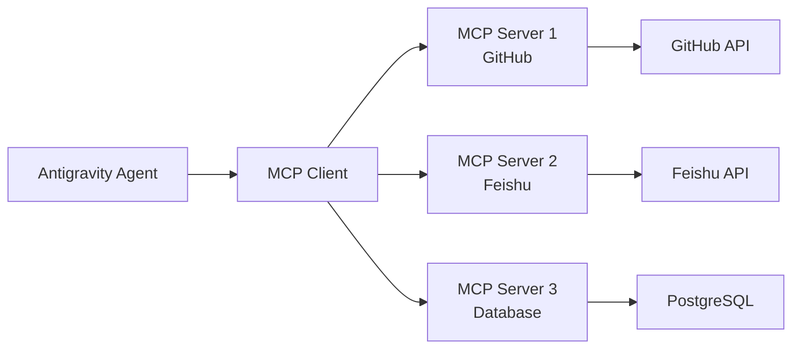
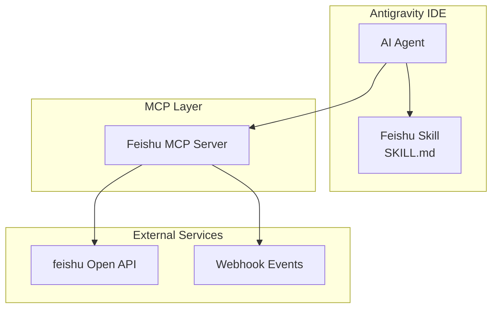
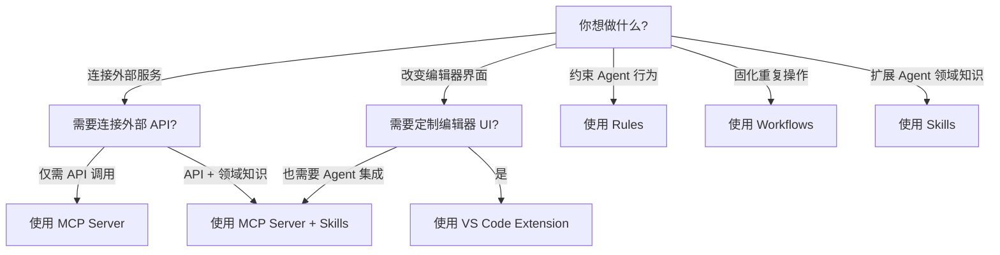

# Antigravity 插件开发指南

## 概述

Google Antigravity 是一个基于 VS Code 深度定制的 **Agent-First（代理优先）** 开发平台。与传统 IDE 插件开发不同，Antigravity 的"插件"概念更广泛，包含多个层级的扩展机制。

## 插件类型一览

Antigravity 的扩展能力分为以下几个层级：

| 层级 | 类型 | 描述 | 难度 |
|------|------|------|------|
| 1 | **Rules（规则）** | 约束 AI Agent 行为的文本规则 | ⭐ 简单 |
| 2 | **Workflows（工作流）** | 可触发的预定义操作步骤 | ⭐ 简单 |
| 3 | **Skills（技能）** | 模块化的能力扩展包 | ⭐⭐ 中等 |
| 4 | **MCP Server（模型上下文协议服务器）** | 连接外部工具和数据源的服务 | ⭐⭐⭐ 较高 |
| 5 | **VS Code Extension（编辑器扩展）** | 传统的编辑器级别插件 | ⭐⭐⭐⭐ 高 |

---

## 层级 1：Rules（规则）

> [!TIP]
> 最简单的入门方式，适合约束 Agent 的行为规范。

### 是什么

Rules 是纯文本规则，用于指导 AI Agent 在特定项目或全局范围内的行为。它们嵌入到系统提示词中，Agent 会严格遵守。

### 需要做的事情

1. **创建规则文件**：在项目根目录创建 `.agents/rules/` 或使用全局用户规则
2. **编写规则内容**：使用 Markdown 格式编写约束条件
3. **测试规则**：与 Agent 对话验证规则是否生效

### 示例

```markdown
<!-- 项目级规则示例 -->
1. 所有代码必须使用 TypeScript 编写
2. 提交信息使用英文，遵循 Conventional Commits 规范
3. 函数注释使用 JSDoc 格式
```

### 适用场景

- 代码风格约束
- 项目特定的开发规范
- 文档格式要求

---

## 层级 2：Workflows（工作流）

> [!TIP]
> 适合将重复性操作固化为可复用的步骤。

### 是什么

Workflows 是预定义的、可通过斜杠命令触发的操作步骤，类似于"保存好的提示词"。

### 需要做的事情

1. **创建工作流目录**：`{.agents,.agent,_agents,_agent}/workflows/`
2. **编写工作流文件**：`.md` 格式，包含 YAML frontmatter 和步骤说明
3. **定义触发方式**：通过 `/workflow-name` 斜杠命令触发

### 文件格式

```markdown
---
description: How to deploy the application to production
---

## Steps

1. Run linting checks
   ```bash
   npm run lint
   ```

2. Run all tests
   ```bash
   npm test
   ```

3. Build production bundle
   ```bash
   npm run build
   ```

4. Deploy to production
   ```bash
   npm run deploy
   ```
```

### 适用场景

- 部署流程
- 代码审查检查清单
- 项目初始化步骤

---

## 层级 3：Skills（技能）

> [!IMPORTANT]
> 这是 Antigravity 最核心的插件机制，能显著扩展 Agent 的专业能力。

### 是什么

Skills 是模块化的、自包含的能力扩展包，通过提供专业知识、工作流和工具来增强 Agent 的能力。可以将 Skills 理解为"特定领域的入职培训手册"。

### 目录结构

```
skill-name/
├── SKILL.md              # 主要说明文件（必需）
│   ├── YAML frontmatter  # 元数据（name + description）
│   └── Markdown 内容     # 详细使用说明
├── scripts/              # 可执行脚本（可选）
├── references/           # 参考文档（可选）
└── assets/               # 资源文件（可选）
```

### 需要做的事情

#### 第 1 步：理解使用场景

- 明确 Skill 要解决的具体问题
- 收集 3 个以上的使用案例
- 确定触发条件（什么情况下应该使用这个 Skill）

#### 第 2 步：规划可复用资源

分析每个案例，确定需要哪些可复用组件：

| 资源类型 | 何时使用 | 示例 |
|----------|----------|------|
| `scripts/` | 需要确定性可靠执行的代码 | `rotate_pdf.py` |
| `references/` | Agent 工作时需要查阅的文档 | `api_docs.md`, `schema.md` |
| `assets/` | 输出中使用的模板/资源文件 | `template.html`, `logo.png` |

#### 第 3 步：编写 SKILL.md

```markdown
---
name: my-awesome-skill
description: Use when working with Feishu API integration, handling webhook events, or sending messages through Feishu bot
---

# My Awesome Skill

## Overview
核心功能一句话说明。

## Quick Reference
| 操作 | 命令/方法 |
|------|-----------|
| 发送消息 | `sendMessage()` |
| 处理事件 | `handleEvent()` |

## Implementation
详细的实现指导...

## Common Mistakes
常见错误及修复方法...
```

#### 第 4 步：测试与迭代

- 在实际任务中使用 Skill
- 观察 Agent 是否正确触发和使用
- 根据反馈迭代优化

### 关键设计原则

1. **精简至上**：只包含 Agent 不知道的信息
2. **渐进式披露**：元数据始终加载，SKILL.md 按需加载，资源文件最后加载
3. **适当的自由度**：根据任务的脆弱性决定指令的具体程度

### Skill 存放位置

- **个人技能**：`~/.gemini/antigravity/skills/`
- **项目技能**：项目目录下的 `.agents/skills/`

---

## 层级 4：MCP Server（模型上下文协议服务器）

> [!IMPORTANT]
> 这是连接外部工具和数据源的关键机制，适合需要与外部系统交互的场景。

### 是什么

MCP（Model Context Protocol）是一个开放标准，充当 AI Agent 与外部系统之间的桥梁。MCP Server 可以为 Agent 提供：

- **Tools（工具）**：Agent 可调用的函数
- **Resources（资源）**：Agent 可读取的数据
- **Prompts（提示）**：预定义的模板化消息

### 架构图



### 需要做的事情

#### 第 1 步：选择技术栈

MCP Server 可以使用多种语言开发：

| 语言 | SDK | 适用场景 |
|------|-----|----------|
| TypeScript/JavaScript | `@modelcontextprotocol/sdk` | Web API 集成 |
| Python | `mcp` | 数据处理、ML |
| Go | 社区 SDK | 高性能服务 |
| Rust | 社区 SDK | 系统级集成 |

#### 第 2 步：创建 MCP Server 项目

以 TypeScript 为例：

```bash
# 初始化项目
mkdir my-mcp-server && cd my-mcp-server
npm init -y
npm install @modelcontextprotocol/sdk

# 项目结构
# my-mcp-server/
# ├── package.json
# ├── tsconfig.json
# └── src/
#     └── index.ts
```

#### 第 3 步：实现 Server 逻辑

```typescript
import { McpServer, ResourceTemplate } from "@modelcontextprotocol/sdk/server/mcp.js";
import { StdioServerTransport } from "@modelcontextprotocol/sdk/server/stdio.js";

const server = new McpServer({
  name: "feishu-mcp-server",
  version: "1.0.0",
});

// 定义工具
server.tool("send_message",
  { chatId: "string", content: "string" },
  async ({ chatId, content }) => {
    // 调用飞书 API 发送消息
    const result = await feishuApi.sendMessage(chatId, content);
    return { content: [{ type: "text", text: JSON.stringify(result) }] };
  }
);

// 定义资源
server.resource("chat-list",
  "feishu://chats",
  async (uri) => {
    const chats = await feishuApi.getChatList();
    return { contents: [{ uri: uri.href, text: JSON.stringify(chats) }] };
  }
);

// 启动
const transport = new StdioServerTransport();
await server.connect(transport);
```

#### 第 4 步：注册到 Antigravity

编辑 `~/.gemini/antigravity/mcp_config.json`：

```json
{
  "mcpServers": {
    "feishu-mcp-server": {
      "command": "node",
      "args": ["path/to/my-mcp-server/dist/index.js"],
      "env": {
        "FEISHU_APP_ID": "your_app_id",
        "FEISHU_APP_SECRET": "your_app_secret"
      }
    }
  }
}
```

#### 第 5 步：测试

- 重启 Antigravity
- 在对话中请求 Agent 使用新工具
- 验证工具调用是否正确

### MCP Server 参考资源

- 官方规范: [modelcontextprotocol.io](https://modelcontextprotocol.io)
- 示例实现: [github.com/github/github-mcp-server](https://github.com/github/github-mcp-server)

---

## 层级 5：VS Code Extension（编辑器扩展）

> [!NOTE]
> 适合需要深度定制编辑器 UI 或行为的场景。由于 Antigravity 基于 VS Code，大部分 VS Code 扩展开发知识可直接复用。

### 需要做的事情

#### 第 1 步：搭建开发环境

```bash
# 安装 Yeoman 和 VS Code 扩展生成器
npm install -g yo generator-code

# 创建扩展项目
yo code
```

#### 第 2 步：开发扩展

- 使用 VS Code Extension API
- 实现命令、视图、语言支持等功能
- 在 `package.json` 中声明贡献点

#### 第 3 步：测试

- 按 F5 启动 Extension Development Host
- 在新窗口中测试扩展功能

#### 第 4 步：打包与安装

```bash
# 安装打包工具
npm install -g vsce

# 打包为 .vsix 文件
vsce package

# 在 Antigravity 中安装
# Extensions 面板 -> ... -> Install from VSIX
```

### 注意事项

- Antigravity 使用 **Open VSX Registry** 而非 VS Code Marketplace
- 部分 VS Code 扩展可能存在兼容性问题
- 如需深度集成 Agent 能力，建议优先考虑 MCP Server 方案

---

## 针对你的项目建议：anti-feishu 插件

根据项目名称 `anti-feishu`，如果你计划开发飞书集成的 Antigravity 插件，推荐的技术路线：

### 推荐方案：MCP Server + Skills 组合



### 实施路线图

| 阶段 | 任务 | 预计时间 |
|------|------|----------|
| Phase 1 | 创建 Feishu Skill，定义飞书 API 使用指南 | 1-2 天 |
| Phase 2 | 开发 Feishu MCP Server，实现核心 API 封装 | 3-5 天 |
| Phase 3 | 集成测试，优化 Agent 与飞书的交互体验 | 2-3 天 |
| Phase 4 | 编写文档，发布到 Open VSX（如需要） | 1-2 天 |

### 核心功能建议

1. **消息收发** - 通过 Agent 发送/接收飞书消息
2. **文档操作** - 读写飞书文档/多维表格
3. **审批流程** - 创建/查询审批实例
4. **日历管理** - 创建/查询日程
5. **Webhook 处理** - 监听飞书事件并触发 Agent 操作

---

## 快速决策指南



---

## 参考资源

- [Google Antigravity 官网](https://antigravity.google)
- [MCP 协议规范](https://modelcontextprotocol.io)
- [VS Code Extension API](https://code.visualstudio.com/api)
- [Open VSX Registry](https://open-vsx.org)
