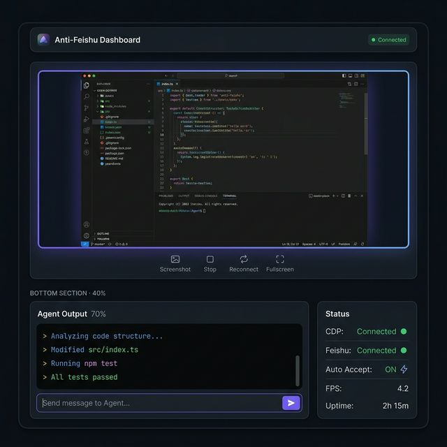
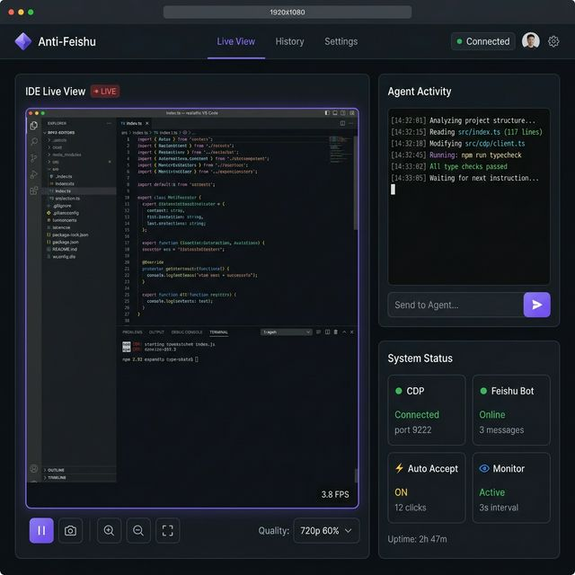
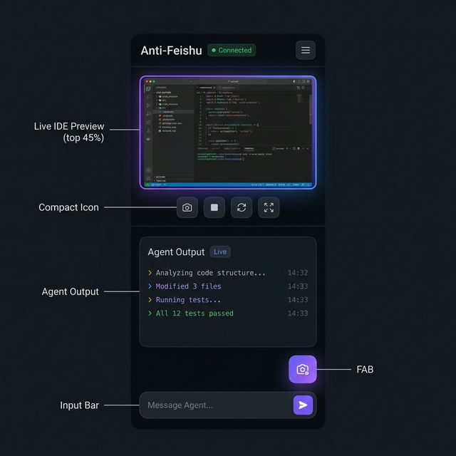

# H5 实时面板 UI 设计规范

> Anti-Feishu Dashboard — 远程监控 Antigravity IDE 的 Web 面板

---

## 1. 设计概览

### 1.1 整体布局概览



面板分为三大区域：
- **顶部 Header**：品牌标识 + 导航 + 连接状态
- **上半部分（60%）**：IDE 实时画面（Canvas 视频流）
- **下半部分（40%）**：Agent 输出 + 系统状态

### 1.2 桌面端完整视图（1920x1080）



桌面端采用左右分栏布局：
- **左侧（65%）**：IDE Live View + 控制工具栏
- **右上（35%）**：Agent Activity 实时输出 + 消息输入
- **右下（35%）**：System Status 状态卡片网格

### 1.3 移动端视图（390px）



移动端采用纵向堆叠布局：
- 视频区域自适应宽度
- Agent 输出区域可滚动
- 底部固定输入栏（类似聊天 App）
- 浮动截图 FAB 按钮

---

## 2. 设计系统

### 2.1 颜色方案（Dark Theme）

```css
:root {
  /* 背景层级 */
  --bg-primary: #0d1117;        /* 主背景 */
  --bg-secondary: #161b22;      /* 卡片/面板 */
  --bg-tertiary: #1c2128;       /* 输入框/嵌套区域 */
  --border-default: #30363d;    /* 默认边框 */
  --border-muted: #21262d;      /* 淡边框 */

  /* 文字 */
  --text-primary: #e6edf3;      /* 主文字 */
  --text-secondary: #8b949e;    /* 次要文字 */
  --text-muted: #484f58;        /* 提示文字 */

  /* 强调色 */
  --accent-purple: #8b5cf6;     /* 主强调色（按钮、高亮） */
  --accent-purple-dim: #6d28d9; /* 深紫（hover） */
  --accent-purple-glow: rgba(139, 92, 246, 0.15); /* 光晕 */

  /* 状态色 */
  --status-green: #3fb950;      /* 已连接/成功 */
  --status-red: #f85149;        /* 断开/错误 */
  --status-yellow: #d29922;     /* 警告 */
  --status-blue: #58a6ff;       /* 信息 */

  /* 特殊 */
  --live-red: #ef4444;          /* LIVE 标记 */
  --terminal-bg: #0a0e14;       /* 终端区域背景 */
}
```

### 2.2 字体

```css
/* 界面文字 */
font-family: 'Inter', -apple-system, BlinkMacSystemFont, 'Segoe UI', sans-serif;

/* 终端/代码输出 */
font-family: 'JetBrains Mono', 'Fira Code', 'SF Mono', Consolas, monospace;
```

使用 Google Fonts 加载：
```html
<link href="https://fonts.googleapis.com/css2?family=Inter:wght@400;500;600;700&family=JetBrains+Mono:wght@400;500&display=swap" rel="stylesheet">
```

### 2.3 间距与圆角

```css
/* 间距 */
--spacing-xs: 4px;
--spacing-sm: 8px;
--spacing-md: 16px;
--spacing-lg: 24px;
--spacing-xl: 32px;

/* 圆角 */
--radius-sm: 6px;     /* 小组件 */
--radius-md: 8px;     /* 卡片 */
--radius-lg: 12px;    /* 面板 */
--radius-full: 9999px; /* 圆形按钮 */
```

### 2.4 阴影

```css
--shadow-sm: 0 1px 2px rgba(0, 0, 0, 0.3);
--shadow-md: 0 4px 12px rgba(0, 0, 0, 0.4);
--shadow-lg: 0 8px 24px rgba(0, 0, 0, 0.5);
--shadow-glow: 0 0 20px var(--accent-purple-glow);
```

---

## 3. 组件规范

### 3.1 Header Bar

```
高度: 48px
背景: var(--bg-secondary) + border-bottom: 1px solid var(--border-default)
内容:
  左侧: Logo 图标（紫色渐变菱形） + "Anti-Feishu" 文字（font-weight: 600）
  中间: Tab 导航 — "Live View"(激活态) | "History" | "Settings"
        激活态: 紫色下划线 2px + text-color: white
        非激活: text-color: var(--text-secondary)
  右侧: 连接状态指示器（绿色脉冲圆点 + "Connected"）
```

### 3.2 视频区域（IDE Live View）

```
容器:
  背景: var(--bg-secondary)
  圆角: var(--radius-lg)
  边框: 1px solid var(--border-default)
  内边距: var(--spacing-md)

标题行:
  左侧: "IDE Live View" (font-size: 14px, font-weight: 600)
  右侧: LIVE 徽章
    背景: var(--live-red)
    圆角: var(--radius-full)
    字体: 11px, font-weight: 700, uppercase
    动画: 左侧圆点 pulse 动画

Canvas 区域:
  宽度: 100%
  高度: auto (保持 16:9 比例)
  背景: #000
  圆角: var(--radius-md)
  边框: 1px solid var(--border-muted)
  溢出: hidden
  效果: box-shadow: var(--shadow-glow) (紫色微光)

无信号状态:
  显示居中文字: "Waiting for connection..."
  图标: 旋转的加载动画
  背景: 渐变噪点纹理
```

### 3.3 控制工具栏

```
位置: 视频区域下方
高度: 40px
布局: flexbox, space-between

按钮组:
  Group 1 (左侧): [暂停/播放] [截图]
  Group 2 (中间): [放大] [缩小] [全屏]
  Group 3 (右侧): 质量下拉菜单 "720p 60%" | FPS 计数器 "3.8 FPS"

按钮样式:
  大小: 32x32px
  圆角: var(--radius-sm)
  背景: transparent
  hover: var(--bg-tertiary)
  active: var(--accent-purple-glow)
  图标: 16x16px, color: var(--text-secondary)
  hover 图标: color: var(--text-primary)
```

### 3.4 Agent Activity 面板

```
容器:
  背景: var(--bg-secondary)
  圆角: var(--radius-lg)
  边框: 1px solid var(--border-default)

标题: "Agent Activity" (14px, font-weight: 600)

输出区域:
  背景: var(--terminal-bg)
  圆角: var(--radius-md)
  字体: JetBrains Mono, 13px
  行高: 1.6
  内边距: var(--spacing-md)
  最大高度: 300px
  滚动: overflow-y: auto, 自动滚动到底部
  滚动条: 细窄 (4px), 紫色

  每行格式:
    时间戳: var(--text-muted), 13px
    内容: var(--text-primary)
    特殊颜色:
      成功消息 (passed/completed): var(--status-green)
      错误消息 (failed/error): var(--status-red)
      运行中 (running/analyzing): var(--status-yellow)
      文件路径: var(--status-blue)

输入框:
  位置: 面板底部
  高度: 36px
  圆角: var(--radius-md)
  背景: var(--bg-tertiary)
  边框: 1px solid var(--border-default)
  focus 边框: var(--accent-purple)
  placeholder: "Send to Agent..." (color: var(--text-muted))
  发送按钮: 36x36px, 紫色渐变圆角, 白色箭头图标
```

### 3.5 System Status 面板

```
容器:
  背景: var(--bg-secondary)
  圆角: var(--radius-lg)
  边框: 1px solid var(--border-default)

标题: "System Status" (14px, font-weight: 600)

状态卡片网格: 2x2 grid
  每个卡片:
    大小: 填满 grid cell
    内边距: var(--spacing-md)
    背景: var(--bg-tertiary)
    圆角: var(--radius-md)
    边框: 1px solid var(--border-muted)

    布局:
      第一行: 图标 + 标题 ("CDP", "Feishu Bot", "Auto Accept", "Monitor")
      第二行: 状态文字 (绿色 "Connected" / 红色 "Disconnected")
      第三行: 补充信息 (灰色, "port 9222", "3 messages" 等)

    状态指示器:
      圆点: 8px 圆形
      已连接: var(--status-green) + pulse 动画
      已断开: var(--status-red)

底部: "Uptime: 2h 47m" (var(--text-muted), 12px)
```

---

## 4. 交互规范

### 4.1 视频区域交互

| 交互 | 行为 |
|------|------|
| 双击视频 | 全屏切换 |
| 鼠标悬停 | 显示控制工具栏（3秒后自动隐藏） |
| 滚轮 | 缩放视频 |
| 拖拽 | 缩放状态下平移视频 |

### 4.2 Agent 输出交互

| 交互 | 行为 |
|------|------|
| 滚动到底部 | 自动跟随新输出 |
| 手动上滚 | 暂停自动跟随，显示 "New messages" 提示 |
| 点击 "New messages" | 滚动到底部，恢复自动跟随 |
| Enter 发送 | 发送消息给 Agent |
| Shift+Enter | 输入框换行 |

### 4.3 快捷键

| 快捷键 | 行为 |
|--------|------|
| `F` | 全屏切换 |
| `S` | 截图并下载 |
| `Space` | 暂停/恢复视频流 |
| `Esc` | 退出全屏 |
| `/` | 聚焦输入框 |

### 4.4 动画

```css
/* LIVE 脉冲动画 */
@keyframes pulse {
  0%, 100% { opacity: 1; }
  50% { opacity: 0.5; }
}

/* 连接状态呼吸灯 */
@keyframes breathe {
  0%, 100% { box-shadow: 0 0 0 0 rgba(63, 185, 80, 0.4); }
  50% { box-shadow: 0 0 0 4px rgba(63, 185, 80, 0); }
}

/* 新消息滑入 */
@keyframes slideIn {
  from { opacity: 0; transform: translateY(8px); }
  to { opacity: 1; transform: translateY(0); }
}

/* 视频区域光晕 */
@keyframes glowPulse {
  0%, 100% { box-shadow: 0 0 15px rgba(139, 92, 246, 0.1); }
  50% { box-shadow: 0 0 25px rgba(139, 92, 246, 0.2); }
}
```

---

## 5. 响应式断点

| 断点 | 布局变化 |
|------|----------|
| >= 1200px | 完整桌面布局（左右分栏） |
| 768-1199px | 视频全宽，下方 Agent 输出和状态左右分栏 |
| < 768px | 纵向堆叠，底部固定输入栏，浮动 FAB |

```css
/* 桌面 */
@media (min-width: 1200px) {
  .main-layout { display: grid; grid-template-columns: 65% 35%; }
}

/* 平板 */
@media (min-width: 768px) and (max-width: 1199px) {
  .main-layout { display: block; }
  .bottom-section { display: grid; grid-template-columns: 70% 30%; }
}

/* 手机 */
@media (max-width: 767px) {
  .main-layout { display: flex; flex-direction: column; }
  .input-bar { position: fixed; bottom: 0; left: 0; right: 0; }
  .fab { position: fixed; bottom: 72px; right: 16px; }
}
```

---

## 6. 技术实现要点

### 6.1 WebSocket 连接管理

```javascript
// 连接状态展示
ws.onopen -> 显示绿色 "Connected" + 呼吸灯动画
ws.onclose -> 显示红色 "Disconnected" + 自动重连倒计时
ws.onerror -> 显示黄色警告 toast

// 自动重连
重连间隔: 1s, 2s, 4s, 8s, 16s (指数退避，最大 30s)
重连时: 显示 "Reconnecting..." + 旋转图标
```

### 6.2 视频渲染管线

```javascript
// 帧处理流程
WebSocket 消息 -> Base64 解码 -> Image 对象 -> Canvas drawImage

// 性能优化
1. 使用 requestAnimationFrame 避免过度渲染
2. 使用 createImageBitmap 代替 new Image（更快）
3. 帧队列最多保留 2 帧，丢弃旧帧
4. 离屏时暂停渲染（Page Visibility API）
```

### 6.3 Agent 输出渲染

```javascript
// 虚拟滚动（如果消息量大）
保留最近 500 条消息
超出后删除最早的消息
使用 DocumentFragment 批量 DOM 操作

// ANSI 颜色解析
简单的正则替换 ANSI escape code 为 CSS class
```

---

## 7. 文件结构

```
src/h5/
  server.ts            # HTTP + WebSocket 服务入口
  screencast.ts        # CDP screencast 管理器
  public/
    index.html         # H5 面板主页面
    css/
      style.css        # 主样式（设计系统 + 布局）
      animations.css   # 动画定义
    js/
      app.js           # 主逻辑入口
      ws-client.js     # WebSocket 客户端管理
      video-renderer.js # Canvas 视频渲染器
      agent-output.js  # Agent 输出面板逻辑
      status-panel.js  # 状态面板逻辑
      shortcuts.js     # 快捷键管理
```
