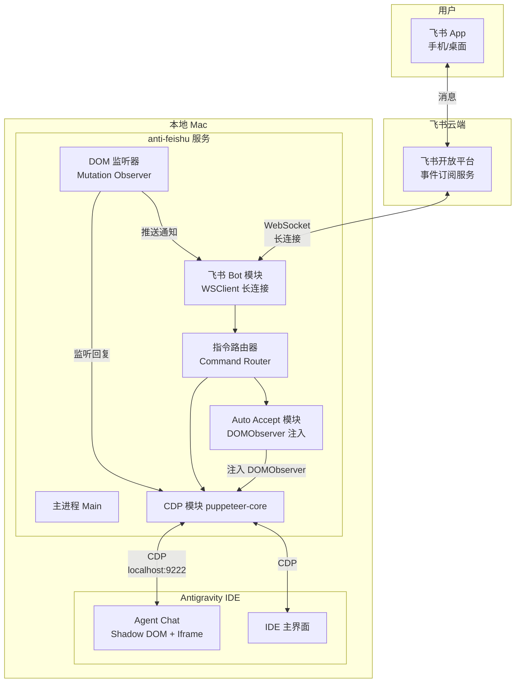
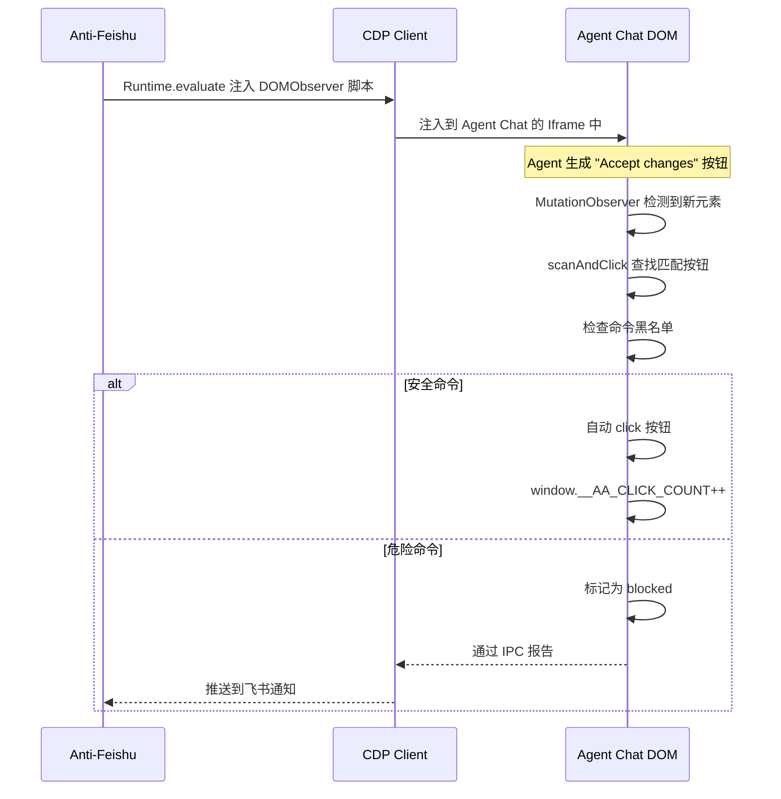
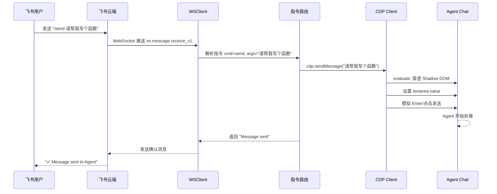
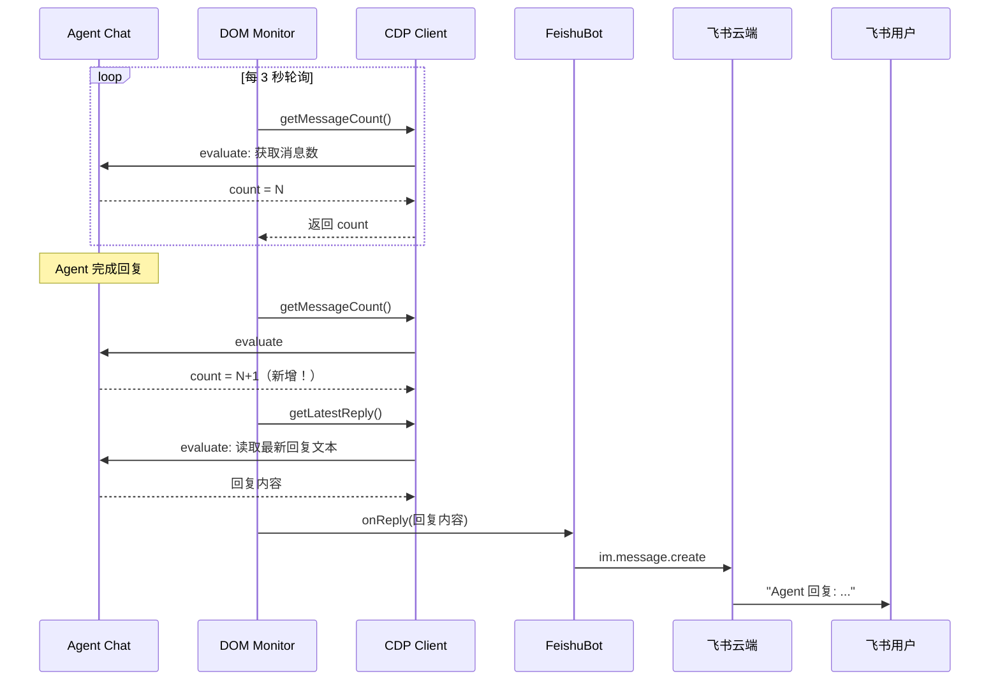
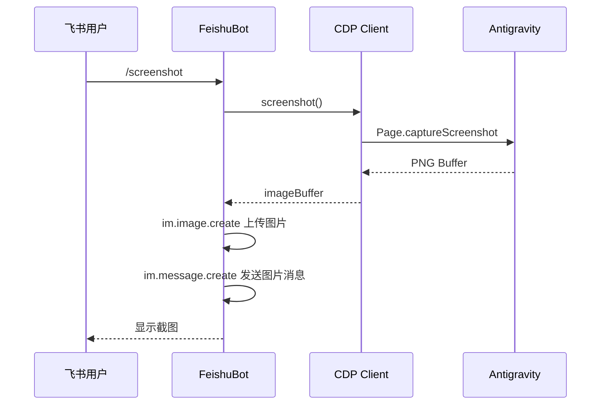

# Anti-Feishu 技术设计方案

> 通过飞书 Bot 远程操控 Antigravity Agent 的独立 Node.js 服务

## 1. 项目概述

### 1.1 目标

构建一个运行在本地 Mac 上的独立 Node.js 服务，通过飞书 Bot 接收用户指令，利用 CDP（Chrome DevTools Protocol）与 Antigravity IDE 交互，实现远程发送消息、查看回复、截图等功能。

### 1.2 范围（Phase 1）

| 功能 | 说明 |
|------|------|
| `/send <msg>` | 发送消息给 Agent |
| `/stop` | 停止当前生成 |
| `/latest` | 获取 Agent 最新回复 |
| `/screenshot` | 获取 IDE 界面截图 |
| `/status` | 查看 IDE 连接状态 |
| `/models` | 列出可用模型 |
| `/select <name>` | 切换模型 |
| `/auto on/off` | 开关 Auto Accept |
| `/auto status` | 查看 Auto Accept 状态和统计 |
| `/help` | 显示帮助信息 |
| 自动推送 | Agent 回复完成时主动推送到飞书 |
| **Auto Accept** | 自动接受 Agent 的文件修改、终端命令等操作 |

### 1.3 不做的事情

- 多账号管理 / 配额轮转
- 透明代理
- 面向团队的多用户管理（Phase 2）

---

## 2. 系统架构

### 2.1 架构总览



### 2.2 组件职责

| 组件 | 职责 | 技术选型 |
|------|------|----------|
| **飞书 Bot 模块** | 接收/发送飞书消息 | `@larksuiteoapi/node-sdk` WSClient |
| **CDP 模块** | 与 IDE Chromium 通信 | `puppeteer-core` |
| **指令路由器** | 解析用户指令并分发 | 自定义 Command Pattern |
| **DOM 监听器** | 监听 Agent 回复变化 | CDP Runtime.evaluate + MutationObserver |
| **Auto Accept 模块** | 自动接受 Agent 操作步骤 | CDP Runtime.evaluate + MutationObserver 注入 |
| **主进程** | 生命周期管理、配置、日志 | Node.js 原生 |

---

## 3. 核心技术方案

### 3.1 飞书 Bot - WebSocket 长连接模式

#### 为什么选 WebSocket 长连接

| 对比 | Webhook 模式 | WebSocket 长连接模式 |
|------|-------------|---------------------|
| 公网 IP | 需要 | **不需要** |
| 内网穿透 | 需要 ngrok 等 | **不需要** |
| 鉴权 | 每次请求需验签 | **仅连接时鉴权一次** |
| 数据格式 | 加密，需解密 | **明文，直接使用** |
| 复杂度 | 高 | **低** |

#### 初始化代码结构

```typescript
// src/feishu/bot.ts
import { Client, WSClient, EventDispatcher } from '@larksuiteoapi/node-sdk';

export class FeishuBot {
  private client: Client;
  private wsClient: WSClient;
  private eventDispatcher: EventDispatcher;

  constructor(appId: string, appSecret: string) {
    // 1. 创建 API Client（用于发送消息）
    this.client = new Client({ appId, appSecret });

    // 2. 创建事件分发器（处理接收的消息）
    this.eventDispatcher = new EventDispatcher({})
      .register({
        'im.message.receive_v1': async (data) => {
          await this.handleMessage(data);
        }
      });

    // 3. 创建 WebSocket 长连接客户端
    this.wsClient = new WSClient({
      appId,
      appSecret,
      eventDispatcher: this.eventDispatcher,
      loggerLevel: 2, // LoggerLevel.info
    });
  }

  async start() {
    await this.wsClient.start();
    console.log('Feishu Bot connected via WebSocket');
  }

  private async handleMessage(data: any) {
    const message = data.message;
    const text = JSON.parse(message.content).text;
    const chatId = message.chat_id;
    
    // 路由到指令处理器
    await this.commandRouter.dispatch(text, chatId);
  }

  async sendText(chatId: string, text: string) {
    await this.client.im.message.create({
      params: { receive_id_type: 'chat_id' },
      data: {
        receive_id: chatId,
        msg_type: 'text',
        content: JSON.stringify({ text }),
      },
    });
  }

  async sendImage(chatId: string, imageBuffer: Buffer) {
    // 1. 上传图片获取 image_key
    const uploadResp = await this.client.im.image.create({
      data: {
        image_type: 'message',
        image: imageBuffer,
      },
    });
    const imageKey = uploadResp.data?.image_key;
    
    // 2. 发送图片消息
    await this.client.im.message.create({
      params: { receive_id_type: 'chat_id' },
      data: {
        receive_id: chatId,
        msg_type: 'image',
        content: JSON.stringify({ image_key: imageKey }),
      },
    });
  }
}
```

### 3.2 CDP 模块 - 与 Antigravity 交互

#### 前置条件

Antigravity IDE 需要以远程调试模式启动：

```bash
# macOS 启动 Antigravity，开启 CDP 调试端口
/Applications/Antigravity.app/Contents/MacOS/Antigravity --remote-debugging-port=9222
```

> 可以通过修改 Antigravity 的桌面快捷方式或创建启动脚本来固化此参数。

#### CDP 连接与核心操作

```typescript
// src/cdp/client.ts
import puppeteer, { Browser, Page } from 'puppeteer-core';

export class CDPClient {
  private browser: Browser | null = null;
  private page: Page | null = null;

  /**
   * 连接到 Antigravity IDE 的 Chromium 实例
   */
  async connect() {
    // 1. 获取 WebSocket 调试 URL
    const response = await fetch('http://localhost:9222/json/version');
    const data = await response.json();
    const wsUrl = data.webSocketDebuggerUrl;

    // 2. 通过 puppeteer-core 连接
    this.browser = await puppeteer.connect({
      browserWSEndpoint: wsUrl,
      defaultViewport: null,
    });

    // 3. 获取 IDE 主页面
    const pages = await this.browser.pages();
    this.page = pages[0]; // 或根据 title 筛选
    
    console.log('CDP connected to Antigravity');
  }

  /**
   * 发送消息给 Agent
   * 核心难点：穿透 Shadow DOM + Iframe 找到 Agent Chat 输入框
   */
  async sendMessage(text: string): Promise<boolean> {
    if (!this.page) throw new Error('CDP not connected');
    
    return await this.page.evaluate(async (msg: string) => {
      // 穿透 Shadow DOM 查找 Agent Chat 区域
      function queryShadow(root: Element | Document, selector: string): Element | null {
        const result = root.querySelector(selector);
        if (result) return result;
        
        const allElements = root.querySelectorAll('*');
        for (const el of allElements) {
          if (el.shadowRoot) {
            const found = queryShadow(el.shadowRoot as any, selector);
            if (found) return found;
          }
        }
        return null;
      }
      
      // 查找 Agent Chat 的 textarea/input
      // 注意：具体选择器需要根据 Antigravity 实际 DOM 结构调整
      const chatInput = queryShadow(document, 'textarea[data-testid="chat-input"]')
        || queryShadow(document, '.chat-input textarea')
        || queryShadow(document, '[role="textbox"]');
      
      if (!chatInput) return false;
      
      // 设置文本内容
      const nativeInputValueSetter = Object.getOwnPropertyDescriptor(
        window.HTMLTextAreaElement.prototype, 'value'
      )?.set;
      nativeInputValueSetter?.call(chatInput, msg);
      chatInput.dispatchEvent(new Event('input', { bubbles: true }));
      
      // 查找并点击发送按钮
      const sendBtn = queryShadow(document, '[data-testid="send-button"]')
        || queryShadow(document, 'button[aria-label="Send"]');
      
      if (sendBtn) {
        (sendBtn as HTMLElement).click();
        return true;
      }
      
      // 或模拟 Enter 键
      chatInput.dispatchEvent(new KeyboardEvent('keydown', {
        key: 'Enter', code: 'Enter', bubbles: true
      }));
      return true;
    }, text);
  }

  /**
   * 获取 Agent 最新回复
   */
  async getLatestReply(): Promise<string> {
    if (!this.page) throw new Error('CDP not connected');
    
    return await this.page.evaluate(() => {
      function queryShadowAll(root: Element | Document, selector: string): Element[] {
        const results: Element[] = [];
        results.push(...root.querySelectorAll(selector));
        
        const allElements = root.querySelectorAll('*');
        for (const el of allElements) {
          if (el.shadowRoot) {
            results.push(...queryShadowAll(el.shadowRoot as any, selector));
          }
        }
        return results;
      }
      
      // 查找所有 Agent 回复消息
      // 选择器需根据实际 DOM 调整
      const messages = queryShadowAll(document, '.message-content');
      if (messages.length === 0) return 'No messages found';
      
      const lastMessage = messages[messages.length - 1];
      return lastMessage.textContent || 'Empty message';
    });
  }

  /**
   * 停止当前生成
   */
  async stopGeneration(): Promise<boolean> {
    if (!this.page) throw new Error('CDP not connected');
    
    return await this.page.evaluate(() => {
      function queryShadow(root: Element | Document, selector: string): Element | null {
        const result = root.querySelector(selector);
        if (result) return result;
        const allElements = root.querySelectorAll('*');
        for (const el of allElements) {
          if (el.shadowRoot) {
            const found = queryShadow(el.shadowRoot as any, selector);
            if (found) return found;
          }
        }
        return null;
      }
      
      const stopBtn = queryShadow(document, '[data-testid="stop-button"]')
        || queryShadow(document, 'button[aria-label="Stop"]');
      
      if (stopBtn) {
        (stopBtn as HTMLElement).click();
        return true;
      }
      return false;
    });
  }

  /**
   * 截图
   */
  async screenshot(): Promise<Buffer> {
    if (!this.page) throw new Error('CDP not connected');
    const screenshot = await this.page.screenshot({ 
      type: 'png',
      fullPage: false 
    });
    return Buffer.from(screenshot);
  }

  /**
   * 检查连接状态
   */  
  async isConnected(): Promise<boolean> {
    try {
      if (!this.page) return false;
      await this.page.evaluate(() => document.title);
      return true;
    } catch {
      return false;
    }
  }
}
```

### 3.3 DOM 监听器 - Agent 回复主动推送

```typescript
// src/cdp/monitor.ts
export class AgentMonitor {
  private cdp: CDPClient;
  private onReply: (text: string) => void;
  private polling: NodeJS.Timeout | null = null;
  private lastMessageCount = 0;

  constructor(cdp: CDPClient, onReply: (text: string) => void) {
    this.cdp = cdp;
    this.onReply = onReply;
  }

  /**
   * 启动轮询监听
   * 使用轮询而非 MutationObserver，
   * 因为跨 Shadow DOM 的 MutationObserver 在 CDP 注入场景中可靠性较低
   */
  start(intervalMs = 3000) {
    this.polling = setInterval(async () => {
      try {
        const currentCount = await this.getMessageCount();
        if (currentCount > this.lastMessageCount) {
          const latestReply = await this.cdp.getLatestReply();
          const isAgentReply = await this.isAgentMessage();
          
          if (isAgentReply) {
            this.onReply(latestReply);
          }
          this.lastMessageCount = currentCount;
        }
      } catch (err) {
        // CDP 断开时静默处理
      }
    }, intervalMs);
  }

  stop() {
    if (this.polling) {
      clearInterval(this.polling);
      this.polling = null;
    }
  }

  private async getMessageCount(): Promise<number> {
    // 返回当前消息数量
    return 0; // 实际实现需根据 DOM 结构
  }

  private async isAgentMessage(): Promise<boolean> {
    // 判断最新消息是否来自 Agent（而非用户）
    return true; // 实际实现需根据 DOM 结构
  }
}
```

### 3.4 Auto Accept 模块

> 借鉴 [yazanbaker94/AntiGravity-AutoAccept](https://github.com/yazanbaker94/AntiGravity-AutoAccept) v3.0 的成熟实现，适配为纯 CDP 方案。

#### 实现原理

AntiGravity-AutoAccept 采用**双通道架构**：
- **Channel 1**: VS Code Commands API 轮询（`antigravity.agent.acceptAgentStep` 等命令）
- **Channel 2**: CDP 注入 MutationObserver，在 DOM 中直接查找并点击按钮

由于我们是独立 Node.js 服务，无法使用 VS Code Extension API，所以**仅使用 Channel 2（纯 CDP 注入）**。

#### 核心机制



#### 目标按钮列表

从 AntiGravity-AutoAccept 源码中提取的按钮关键字：

```typescript
// src/cdp/auto-accept.ts

// 需要自动点击的按钮文本（小写匹配）
const BUTTON_TEXTS = [
  'accept',           // Accept changes
  'run',              // Run command  
  'allow',            // Allow permission
  'approve',          // Approve action
  'retry',            // Retry on failure
  'continue',         // Continue generation
  'confirm',          // Confirm dialog
];

// 展开/预览按钮（不做命令过滤）
const EXPAND_TEXTS = [
  'expand',           // Expand collapsed content
  'requires input',   // Show input field
];
```

#### Auto Accept 模块实现

```typescript
// src/cdp/auto-accept.ts
import { CDPClient } from './client';

export interface AutoAcceptConfig {
  enabled: boolean;
  blockedCommands: string[];     // 黑名单命令
  allowedCommands: string[];     // 白名单命令（留空=全部允许）
  autoAcceptFileEdits: boolean;  // 是否自动接受文件修改
  retryLimit: number;            // Retry 熔断次数
  retryWindowMs: number;         // Retry 熔断时间窗口
}

export class AutoAcceptManager {
  private cdp: CDPClient;
  private config: AutoAcceptConfig;
  private enabled = false;
  private clickCount = 0;
  private blockedCount = 0;
  private heartbeatTimer: NodeJS.Timeout | null = null;
  private onEvent: (event: string) => void;

  constructor(
    cdp: CDPClient,
    config: AutoAcceptConfig,
    onEvent: (event: string) => void
  ) {
    this.cdp = cdp;
    this.config = config;
    this.onEvent = onEvent;
  }

  /**
   * 启用 Auto Accept
   * 将 DOMObserver 脚本注入到 IDE 的 Agent Chat 相关页面
   */
  async enable(): Promise<boolean> {
    if (this.enabled) return true;

    try {
      // 获取所有 targets（包括 iframe）
      const targets = await this.getAgentTargets();
      
      for (const target of targets) {
        await this.injectObserver(target);
      }

      // 启动心跳监控
      this.startHeartbeat();
      this.enabled = true;
      this.onEvent('Auto Accept enabled');
      return true;
    } catch (err) {
      this.onEvent(`Auto Accept failed: ${err}`);
      return false;
    }
  }

  /**
   * 禁用 Auto Accept
   */
  async disable(): Promise<void> {
    if (!this.enabled) return;
    
    try {
      // 设置暂停标记（不断开 observer，便于重新启用）
      await this.cdp.evaluateOnAllTargets(
        `window.__AA_PAUSED = true;`
      );
    } catch {}
    
    this.stopHeartbeat();
    this.enabled = false;
    this.onEvent('Auto Accept disabled');
  }

  /**
   * 获取状态统计
   */
  async getStats(): Promise<string> {
    let clickCount = 0;
    let diagLog: any[] = [];
    
    try {
      clickCount = await this.cdp.evaluate(
        `window.__AA_CLICK_COUNT || 0`
      );
      diagLog = await this.cdp.evaluate(
        `(window.__AA_DIAG || []).slice(-10)`
      );
    } catch {}

    const lines = [
      `⚡ Auto Accept ${this.enabled ? 'ON' : 'OFF'}`,
      `📊 Total Clicks: ${clickCount}`,
      `🚫 Total Blocked: ${this.blockedCount}`,
      '',
      '📋 Recent Activity:',
    ];

    for (const d of diagLog) {
      const time = new Date(d.time).toLocaleTimeString();
      if (d.action === 'CLICKED') {
        lines.push(`  ✅ ${time} clicked: ${d.matched}`);
      } else if (d.action === 'BLOCKED') {
        lines.push(`  🚫 ${time} blocked: ${d.cmd}`);
      } else if (d.action === 'CIRCUIT_BREAKER') {
        lines.push(`  ⚠️ ${time} circuit breaker (retries: ${d.count})`);
      }
    }

    return lines.join('\n');
  }

  /**
   * 注入 DOMObserver 脚本
   * 核心：在 CDP target 中注入 JS，通过 MutationObserver
   * 监听 DOM 变化，自动查找并点击 accept/run 等按钮
   */
  private async injectObserver(targetId: string): Promise<void> {
    const script = this.buildDOMObserverScript();
    await this.cdp.evaluateOnTarget(targetId, script);
  }

  /**
   * 构建 DOMObserver 注入脚本
   * 参考 AntiGravity-AutoAccept 的 DOMObserver.js
   */
  private buildDOMObserverScript(): string {
    const blocked = JSON.stringify(this.config.blockedCommands);
    const allowed = JSON.stringify(this.config.allowedCommands);
    const hasFilters = this.config.blockedCommands.length > 0 
      || this.config.allowedCommands.length > 0;

    return `(function() {
      // 防重复注入
      if (window.__AA_OBSERVER) return 'already-installed';
      
      var BUTTON_TEXTS = ['accept','run','allow','approve','retry','continue','confirm'];
      var EXPAND_TEXTS = ['expand','requires input'];
      var BLOCKED_COMMANDS = ${blocked};
      var ALLOWED_COMMANDS = ${allowed};
      var HAS_FILTERS = ${hasFilters};
      var COOLDOWN_MS = 2000;
      var clickCooldowns = {};
      
      // 查找按钮：遍历 DOM 树，匹配按钮文本
      function findButton(root, texts) {
        var buttons = root.querySelectorAll('button, [role="button"]');
        for (var i = 0; i < buttons.length; i++) {
          var btn = buttons[i];
          if (btn.getAttribute('data-aa-blocked')) continue;
          var text = (btn.textContent || '').trim().toLowerCase();
          for (var t = 0; t < texts.length; t++) {
            if (text.indexOf(texts[t]) !== -1) {
              // 冷却检查
              var key = texts[t] + ':' + text.substring(0, 30);
              if (clickCooldowns[key] && Date.now() - clickCooldowns[key] < COOLDOWN_MS) continue;
              return { node: btn, matchedText: texts[t] };
            }
          }
        }
        // 递归穿透 Shadow DOM
        var all = root.querySelectorAll('*');
        for (var j = 0; j < all.length; j++) {
          if (all[j].shadowRoot) {
            var found = findButton(all[j].shadowRoot, texts);
            if (found) return found;
          }
        }
        return null;
      }
      
      // 提取按钮附近的命令文本
      function extractCommandText(btn) {
        var el = btn;
        for (var i = 0; i < 8 && el && el !== document.body; i++) {
          el = el.parentElement;
          if (!el) break;
          var codes = el.querySelectorAll('pre, code');
          if (codes.length > 0) {
            var allText = '';
            for (var j = 0; j < codes.length; j++) {
              allText += ' ' + (codes[j].textContent || '').trim();
            }
            allText = allText.trim();
            if (allText.length > 0) return allText;
          }
        }
        return null;
      }
      
      // 命令黑白名单检查
      function isCommandAllowed(cmdText) {
        if (!HAS_FILTERS) return true;
        if (!cmdText) return false;
        var cmdLower = cmdText.toLowerCase();
        for (var b = 0; b < BLOCKED_COMMANDS.length; b++) {
          if (cmdLower.indexOf(BLOCKED_COMMANDS[b].toLowerCase()) !== -1) return false;
        }
        if (ALLOWED_COMMANDS.length > 0) {
          var allowed = false;
          for (var a = 0; a < ALLOWED_COMMANDS.length; a++) {
            if (cmdLower.indexOf(ALLOWED_COMMANDS[a].toLowerCase()) !== -1) { allowed = true; break; }
          }
          if (!allowed) return false;
        }
        return true;
      }
      
      // 扫描并点击
      function scanAndClick() {
        window.__AA_LAST_SCAN = Date.now();
        if (window.__AA_PAUSED) return null;
        
        var allTexts = BUTTON_TEXTS.concat(EXPAND_TEXTS);
        var match = findButton(document.body, allTexts);
        if (!match) return null;
        
        var btn = match.node;
        var matchedText = match.matchedText;
        
        // Retry 熔断器：防止无限循环
        if (matchedText === 'retry' || matchedText === 'continue') {
          window.__AA_RECOVERY_TS = window.__AA_RECOVERY_TS || [];
          var now = Date.now();
          window.__AA_RECOVERY_TS = window.__AA_RECOVERY_TS.filter(function(ts) { return now - ts < 60000; });
          if (window.__AA_RECOVERY_TS.length >= 3) return 'blocked:circuit_breaker';
          window.__AA_RECOVERY_TS.push(now);
        }
        
        // 命令安全检查
        if (HAS_FILTERS && matchedText !== 'expand' && matchedText !== 'requires input') {
          var cmdText = extractCommandText(btn);
          if (cmdText && !isCommandAllowed(cmdText)) {
            btn.setAttribute('data-aa-blocked', 'true');
            if (!window.__AA_DIAG) window.__AA_DIAG = [];
            window.__AA_DIAG.push({ action: 'BLOCKED', time: Date.now(), matched: matchedText, cmd: cmdText.substring(0, 60) });
            return 'blocked:filter';
          }
        }
        
        // 点击！
        btn.click();
        window.__AA_CLICK_COUNT = (window.__AA_CLICK_COUNT || 0) + 1;
        if (!window.__AA_DIAG) window.__AA_DIAG = [];
        window.__AA_DIAG.push({ action: 'CLICKED', time: Date.now(), matched: matchedText });
        
        // 保持诊断日志 50 条以内
        if (window.__AA_DIAG.length > 50) window.__AA_DIAG = window.__AA_DIAG.slice(-50);
        
        return 'clicked:' + matchedText;
      }
      
      // 初始扫描
      try { scanAndClick(); } catch(e) {}
      
      // MutationObserver：事件驱动，零轮询
      var scanQueued = false;
      var observer = new MutationObserver(function() {
        if (scanQueued || window.__AA_PAUSED) return;
        scanQueued = true;
        setTimeout(function() {
          try { scanAndClick(); } catch(e) {}
          finally { scanQueued = false; }
        }, 50);
      });
      
      observer.observe(document.documentElement, {
        childList: true, subtree: true,
        attributes: true, attributeFilter: ['class', 'style', 'hidden', 'aria-expanded']
      });
      
      // 后备轮询（10 秒一次，防止 MutationObserver 遗漏）
      if (window.__AA_FALLBACK_INTERVAL) clearInterval(window.__AA_FALLBACK_INTERVAL);
      window.__AA_FALLBACK_INTERVAL = setInterval(function() {
        if (window.__AA_PAUSED) return;
        window.__AA_LAST_SCAN = Date.now();
        try { scanAndClick(); } catch(e) {}
      }, 10000);
      
      window.__AA_OBSERVER = observer;
      return 'observer-installed';
    })()`;
  }

  /**
   * 心跳监控：检查注入的 observer 是否还在运行
   */
  private startHeartbeat() {
    this.heartbeatTimer = setInterval(async () => {
      if (!this.enabled) return;
      try {
        const lastScan = await this.cdp.evaluate(
          `window.__AA_LAST_SCAN || 0`
        );
        const stale = Date.now() - lastScan > 30000;
        if (stale) {
          this.onEvent('⚠️ Auto Accept watchdog: observer stale, re-injecting...');
          await this.enable(); // 重新注入
        }
      } catch {}
    }, 15000);
  }

  private stopHeartbeat() {
    if (this.heartbeatTimer) {
      clearInterval(this.heartbeatTimer);
      this.heartbeatTimer = null;
    }
  }

  private async getAgentTargets(): Promise<string[]> {
    // 通过 CDP 获取所有相关的 target（主页面 + iframe）
    // 实际实现需根据 Antigravity 的 target 结构
    return ['main'];
  }
}
```

#### 安全防护

| 防护措施 | 说明 |
|----------|------|
| **命令黑名单** | `rm -rf`、`sudo`、`format`、`drop table` 等危险命令不自动执行 |
| **命令白名单** | 可选，配置后只自动执行白名单内的命令 |
| **Retry 熔断** | 60 秒内最多自动 retry 3 次，防止无限循环 |
| **冷却时间** | 同一按钮 2 秒内不重复点击 |
| **飞书通知** | 被拦截的命令实时推送到飞书 |
| **远程开关** | 通过飞书 `/auto off` 随时关闭 |

#### 默认黑名单

```typescript
const DEFAULT_BLOCKED_COMMANDS = [
  'rm -rf',
  'rm -r /',
  'sudo',
  'mkfs',
  'format',
  'drop table',
  'drop database',
  'truncate',
  'shutdown',
  'reboot',
  ':(){:|:&};:',       // fork bomb
  'dd if=',
  'chmod -R 777',
  'git push --force',
  'git reset --hard',
];
```

### 3.5 指令路由器

```typescript
// src/commands/router.ts
export interface CommandContext {
  chatId: string;
  args: string[];
  rawText: string;
}

type CommandHandler = (ctx: CommandContext) => Promise<void>;

export class CommandRouter {
  private commands = new Map<string, CommandHandler>();
  private cdp: CDPClient;
  private bot: FeishuBot;

  register(name: string, handler: CommandHandler) {
    this.commands.set(name, handler);
  }

  async dispatch(text: string, chatId: string) {
    // 解析指令: "/send hello world" -> cmd="send", args=["hello", "world"]
    if (!text.startsWith('/')) {
      // 非指令消息，直接当作发给 Agent 的内容
      await this.commands.get('send')?.({
        chatId, args: [text], rawText: text
      });
      return;
    }

    const parts = text.slice(1).split(/\s+/);
    const cmd = parts[0].toLowerCase();
    const args = parts.slice(1);

    const handler = this.commands.get(cmd);
    if (handler) {
      await handler({ chatId, args, rawText: text });
    } else {
      await this.bot.sendText(chatId, 
        `Unknown command: /${cmd}\nType /help for available commands.`
      );
    }
  }
}
```

### 3.5 指令处理器实现

```typescript
// src/commands/handlers.ts

export function registerCommands(
  router: CommandRouter,
  cdp: CDPClient,
  bot: FeishuBot
) {
  // /send <message> - 发送消息给 Agent
  router.register('send', async (ctx) => {
    const message = ctx.args.join(' ');
    if (!message) {
      await bot.sendText(ctx.chatId, 'Usage: /send <message>');
      return;
    }
    
    const success = await cdp.sendMessage(message);
    if (success) {
      await bot.sendText(ctx.chatId, `✅ Message sent to Agent`);
    } else {
      await bot.sendText(ctx.chatId, `❌ Failed to send. Is Agent Chat open?`);
    }
  });

  // /latest - 获取最新回复
  router.register('latest', async (ctx) => {
    const reply = await cdp.getLatestReply();
    // 飞书消息长度限制，超长需分片
    const chunks = splitMessage(reply, 4000);
    for (const chunk of chunks) {
      await bot.sendText(ctx.chatId, chunk);
    }
  });

  // /stop - 停止生成
  router.register('stop', async (ctx) => {
    const success = await cdp.stopGeneration();
    await bot.sendText(ctx.chatId, 
      success ? '⏹ Generation stopped' : '⚠️ No active generation found'
    );
  });

  // /screenshot - 截图
  router.register('screenshot', async (ctx) => {
    const image = await cdp.screenshot();
    await bot.sendImage(ctx.chatId, image);
  });

  // /status - 状态
  router.register('status', async (ctx) => {
    const connected = await cdp.isConnected();
    const status = connected 
      ? '🟢 IDE Connected (CDP port 9222)'
      : '🔴 IDE Disconnected';
    await bot.sendText(ctx.chatId, status);
  });

  // /help - 帮助
  router.register('help', async (ctx) => {
    await bot.sendText(ctx.chatId, [
      '📖 Anti-Feishu Commands:',
      '',
      '/send <msg> - Send message to Agent',
      '/latest - Get latest Agent reply',
      '/stop - Stop current generation',
      '/screenshot - Capture IDE screenshot',
      '/status - Check IDE connection',
      '/models - List available models',
      '/select <name> - Switch model',
      '/help - Show this help',
      '',
      'Or just type without / to send directly to Agent',
    ].join('\n'));
  });
}

function splitMessage(text: string, maxLen: number): string[] {
  const chunks: string[] = [];
  for (let i = 0; i < text.length; i += maxLen) {
    chunks.push(text.slice(i, i + maxLen));
  }
  return chunks;
}
```

---

## 4. 项目结构

```
anti-feishu/
├── package.json
├── tsconfig.json
├── .env                          # 飞书凭证（不入 Git）
├── .env.example                  # 环境变量模板
├── .gitignore
├── src/
│   ├── index.ts                  # 入口，启动服务
│   ├── config.ts                 # 配置管理
│   ├── feishu/
│   │   └── bot.ts                # 飞书 Bot（WSClient 长连接）
│   ├── cdp/
│   │   ├── client.ts             # CDP 连接与操作
│   │   ├── selectors.ts          # DOM 选择器常量（便于维护）
│   │   └── monitor.ts            # Agent 回复监听
│   ├── commands/
│   │   ├── router.ts             # 指令路由
│   │   └── handlers.ts           # 各指令实现
│   └── utils/
│       ├── logger.ts             # 日志
│       └── helpers.ts            # 工具函数
├── scripts/
│   ├── start-antigravity.sh      # 带 CDP 参数启动 Antigravity
│   └── install-service.sh        # 安装为 macOS 系统服务（Phase 2）
└── docs/
    └── plans/
        └── 2026-03-18-anti-feishu-design.zh.md
```

---

## 5. 技术选型

### 5.1 依赖清单

| 包名 | 版本 | 用途 |
|------|------|------|
| `@larksuiteoapi/node-sdk` | `^1.x` | 飞书 SDK（WSClient + API） |
| `puppeteer-core` | `^23.x` | CDP 控制（不自带 Chromium） |
| `dotenv` | `^16.x` | 环境变量管理 |
| `typescript` | `^5.x` | 类型安全 |
| `tsx` | `^4.x` | 直接运行 TS（开发阶段） |
| `pino` | `^9.x` | 高性能日志 |

### 5.2 为什么用 puppeteer-core 而不是原生 CDP

| 对比 | 原生 CDP（chrome-remote-interface） | puppeteer-core |
|------|-----------------------------------|----|
| API 友好度 | 低层，需要手动管理 session | 高层封装，链式 API |
| Shadow DOM 穿透 | 需要手写递归 | 内置 `pierce` 选择器 |
| 截图 | 需要手动调用 `Page.captureScreenshot` | `page.screenshot()` |
| 维护 | 社区维护 | Google 官方维护 |
| 体积 | 极小 | 较小（core 不含浏览器） |

---

## 6. 数据流详解

### 6.1 发送消息流程



### 6.2 Agent 回复推送流程



### 6.3 截图流程



---

## 7. 配置管理

### 7.1 环境变量

```bash
# .env
# 飞书应用凭证（从飞书开放平台获取）
FEISHU_APP_ID=cli_xxxxxxxxxxxx
FEISHU_APP_SECRET=xxxxxxxxxxxxxxxxxxxx

# CDP 配置
CDP_PORT=9222
CDP_HOST=localhost

# 安全配置
FEISHU_ALLOWED_USER_IDS=ou_xxxxxxxxxxxx  # 允许的飞书用户 ID，逗号分隔

# 监控配置
MONITOR_INTERVAL_MS=3000  # Agent 回复轮询间隔
MONITOR_ENABLED=true      # 是否启用自动推送

# 日志
LOG_LEVEL=info
```

### 7.2 飞书应用配置清单

在飞书开放平台需要完成以下配置：

| 步骤 | 操作 | 说明 |
|------|------|------|
| 1 | 创建自建应用 | 开发者后台 -> 创建应用 |
| 2 | 启用机器人能力 | 应用能力 -> 添加机器人 |
| 3 | 获取 App ID / Secret | 凭证与基础信息页面 |
| 4 | 配置权限 | `im:message`（发消息）、`im:message.receive`（收消息）、`im:resource`（上传图片） |
| 5 | 订阅事件 | 添加 `im.message.receive_v1` 事件 |
| 6 | 选择长连接模式 | 事件订阅方式选择"使用长连接接收事件" |
| 7 | 发布应用 | 创建版本并发布 |

---

## 8. 错误处理与重连

### 8.1 CDP 断线重连

```typescript
// src/cdp/client.ts（补充）
export class CDPClient {
  private reconnectTimer: NodeJS.Timeout | null = null;
  private maxRetries = 10;
  private retryCount = 0;
  private retryDelay = 5000; // 5 秒

  async connectWithRetry() {
    try {
      await this.connect();
      this.retryCount = 0;
    } catch (err) {
      this.retryCount++;
      if (this.retryCount <= this.maxRetries) {
        console.log(
          `CDP connection failed, retry ${this.retryCount}/${this.maxRetries} ` +
          `in ${this.retryDelay / 1000}s...`
        );
        this.reconnectTimer = setTimeout(
          () => this.connectWithRetry(),
          this.retryDelay
        );
      } else {
        console.error('CDP connection failed after max retries');
      }
    }
  }

  // 监听断开事件
  private setupDisconnectHandler() {
    this.browser?.on('disconnected', () => {
      console.warn('CDP disconnected, attempting reconnect...');
      this.retryCount = 0;
      this.connectWithRetry();
    });
  }
}
```

### 8.2 错误处理策略

| 场景 | 处理方式 |
|------|----------|
| IDE 未启动 | CDP 连接失败，返回友好提示，定时重试 |
| IDE 未开启 CDP 端口 | 提示用户重新启动 IDE |
| Agent Chat 未打开 | 提示用户打开 Agent Chat 面板 |
| 飞书 WebSocket 断开 | SDK 内置自动重连 |
| DOM 选择器失效（IDE 更新） | 日志告警，选择器集中管理便于修复 |
| 消息过长 | 自动分片发送 |

---

## 9. 安全设计

### 9.1 用户白名单

```typescript
// 只允许指定的飞书用户操作
private isAllowed(userId: string): boolean {
  const allowedUsers = process.env.FEISHU_ALLOWED_USER_IDS?.split(',') || [];
  return allowedUsers.includes(userId);
}
```

### 9.2 危险指令过滤

```typescript
// 可选：过滤发送给 Agent 的危险内容
const DANGEROUS_PATTERNS = [
  /rm\s+-rf/i,
  /sudo\s+/i,
  /format\s+/i,
  /drop\s+table/i,
];

function isSafe(message: string): boolean {
  return !DANGEROUS_PATTERNS.some(p => p.test(message));
}
```

### 9.3 凭证安全

- 飞书 App Secret 存放在 `.env`，不入 Git
- `.env` 加入 `.gitignore`
- 提供 `.env.example` 作为模板

---

## 10. 启动与运行

### 10.1 入口文件

```typescript
// src/index.ts
import dotenv from 'dotenv';
import { FeishuBot } from './feishu/bot';
import { CDPClient } from './cdp/client';
import { AgentMonitor } from './cdp/monitor';
import { CommandRouter } from './commands/router';
import { registerCommands } from './commands/handlers';

dotenv.config();

async function main() {
  console.log('🚀 Anti-Feishu starting...');

  // 1. 初始化 CDP
  const cdp = new CDPClient();
  await cdp.connectWithRetry();

  // 2. 初始化飞书 Bot
  const bot = new FeishuBot(
    process.env.FEISHU_APP_ID!,
    process.env.FEISHU_APP_SECRET!,
  );

  // 3. 注册指令
  const router = new CommandRouter();
  registerCommands(router, cdp, bot);
  bot.setCommandRouter(router);

  // 4. 启动 Agent 回复监听
  const monitor = new AgentMonitor(cdp, async (reply) => {
    // 收到 Agent 回复时推送到飞书
    const chatId = bot.getLastChatId();
    if (chatId) {
      await bot.sendText(chatId, `🤖 Agent Reply:\n\n${reply}`);
    }
  });
  
  if (process.env.MONITOR_ENABLED === 'true') {
    const interval = parseInt(process.env.MONITOR_INTERVAL_MS || '3000');
    monitor.start(interval);
  }

  // 5. 启动飞书 WebSocket 连接
  await bot.start();
  
  console.log('✅ Anti-Feishu is running!');

  // 优雅退出
  process.on('SIGINT', () => {
    console.log('Shutting down...');
    monitor.stop();
    process.exit(0);
  });
}

main().catch(console.error);
```

### 10.2 运行命令

```bash
# 开发模式
npx tsx src/index.ts

# 或使用 npm scripts
npm run dev    # tsx watch src/index.ts
npm run start  # node dist/index.js
npm run build  # tsc
```

---

## 11. 已知风险与应对

### 11.1 DOM 选择器脆弱性

**问题**：Antigravity IDE 更新后，Agent Chat 的 DOM 结构可能变化，导致选择器失效。

**应对**：
1. 选择器集中管理在 `selectors.ts`，单点维护
2. 使用多个候选选择器（fallback 链）
3. 优先使用 `data-testid`、`role`、`aria-label` 等语义化属性
4. 启动时自检选择器是否有效

```typescript
// src/cdp/selectors.ts
export const SELECTORS = {
  chatInput: [
    'textarea[data-testid="chat-input"]',
    '.chat-input textarea',
    '[role="textbox"]',
    'textarea',
  ],
  sendButton: [
    '[data-testid="send-button"]',
    'button[aria-label="Send"]',
    'button[title="Send"]',
  ],
  stopButton: [
    '[data-testid="stop-button"]',
    'button[aria-label="Stop"]',
    'button[title="Stop generating"]',
  ],
  messages: [
    '.message-content',
    '[data-testid="message"]',
    '.chat-message',
  ],
};
```

### 11.2 实施第一步：选择器探测

在正式开发前，**必须先手动探测 Antigravity IDE 的实际 DOM 结构**：

```bash
# 1. 以调试模式启动 Antigravity
/Applications/Antigravity.app/Contents/MacOS/Antigravity --remote-debugging-port=9222

# 2. 浏览器访问调试页面
open http://localhost:9222

# 3. 通过 Chrome DevTools 检查 Agent Chat 的 DOM 结构
#    找到输入框、发送按钮、消息列表的选择器
```

---

## 12. 实施计划

| 阶段 | 任务 | 预计时间 |
|------|------|----------|
| **准备** | 飞书开放平台创建应用、配置权限 | 0.5 天 |
| **准备** | 探测 Antigravity Agent Chat DOM 结构 | 0.5 天 |
| **Step 1** | 项目初始化，飞书 Bot WebSocket 连通 | 0.5 天 |
| **Step 2** | CDP 连接 Antigravity，实现 screenshot | 0.5 天 |
| **Step 3** | 实现 send/latest/stop 核心指令 | 1 天 |
| **Step 4** | Agent 回复自动推送（DOM Monitor） | 1 天 |
| **Step 5** | 错误处理、重连、日志完善 | 0.5 天 |
| **Step 6** | 端到端测试、文档完善 | 0.5 天 |
| **总计** | | **~4.5 天** |
